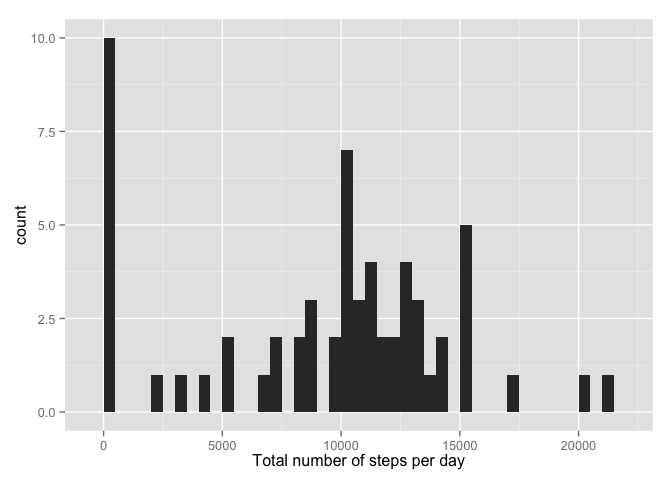
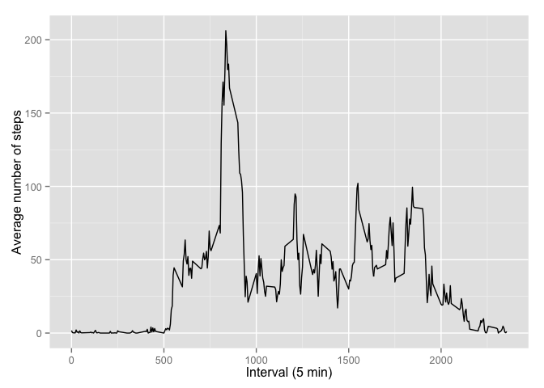
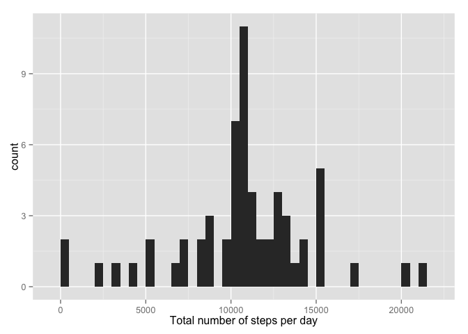
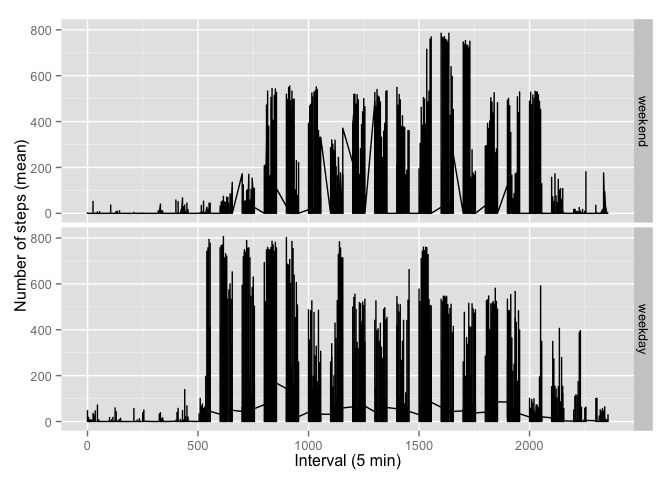

# Reproducible Research: Peer Assessment 1
Matt Rogman  
16 Aug 2015  

```r
library(ggplot2)
```

## Loading and preprocessing the data

```r
## load data
if(!file.exists('activity.csv')) unzip('activity.zip')
monitorData <- read.csv('activity.csv')
```


## What is mean total number of steps taken per day?

```r
## plot and get mean and median of total steps
totalSteps <- tapply(monitorData$steps, monitorData$date, sum, na.rm=TRUE)
qplot(totalSteps, xlab='Total number of steps per day', binwidth=500)
```

 

```r
mean(totalSteps)
```

```
## [1] 9354.23
```

```r
median(totalSteps)
```

```
## [1] 10395
```


## What is the average daily activity pattern?

```r
## plot step means per 5 min interval
averageStepsPerInterval <- aggregate(x=list(steps=monitorData$steps), by=list(interval=monitorData$interval), mean, na.rm=TRUE)
ggplot(averageStepsPerInterval, aes(x=interval, y=steps)) +
  geom_line() +
  xlab("Interval (5 min)") +
  ylab("Average number of steps")
```

 

```r
## get 5-min max
averageStepsPerInterval[which.max(averageStepsPerInterval$steps),]
```

```
##     interval    steps
## 104      835 206.1698
```

## Imputing missing values
Missing values, represented as `NA`, have skewed the data (compare steps/interval plot, mean, and median before and after imputing missing values). All `NA` values were replaced with the interval mean to provide a more realistic representation of the data had all values been recorded.

```r
## total No. entries with NA values
sum(is.na(monitorData$steps))
```

```
## [1] 2304
```

```r
## copy monitor data and fill missing values with mean
filledMonitorData <- monitorData
for (i in 1:nrow(filledMonitorData)) {
  if (is.na(filledMonitorData$steps[i])) {
    filledMonitorData$steps[i] <- averageStepsPerInterval[which(filledMonitorData$interval[i]==averageStepsPerInterval$interval),]$steps
  }
}

## total No. entries with NA values after replacement
sum(is.na(filledMonitorData$steps))
```

```
## [1] 0
```

```r
## replot total steps and calculate mean and median with new (filled) data set
totalStepsFilled <- tapply(filledMonitorData$steps, filledMonitorData$date, sum)
qplot(totalStepsFilled, binwidth=500, xlab="Total number of steps per day")
```

 

```r
mean(totalStepsFilled)
```

```
## [1] 10766.19
```

```r
median(totalStepsFilled)
```

```
## [1] 10766.19
```


## Are there differences in activity patterns between weekdays and weekends?

```r
## new factor with two levels: weekday & weekend
daysofweek <- c("Monday", "Tuesday", "Wednesday", "Thursday", "Friday")
filledMonitorData$dayOfWeek <- factor((weekdays(as.Date(filledMonitorData$date)) %in% daysofweek),
                                     levels=c(FALSE, TRUE), labels=c('weekend', 'weekday'))

## plot average steps per interval with weekend/weekday facets
averageSteps <- aggregate(steps ~ interval + dayOfWeek, data=filledMonitorData, mean)
ggplot(filledMonitorData, aes(interval, steps)) +
  geom_line() +
  facet_grid(dayOfWeek ~ .) +
  xlab("Interval (5 min)") +
  ylab("Number of steps (mean)")
```

 
